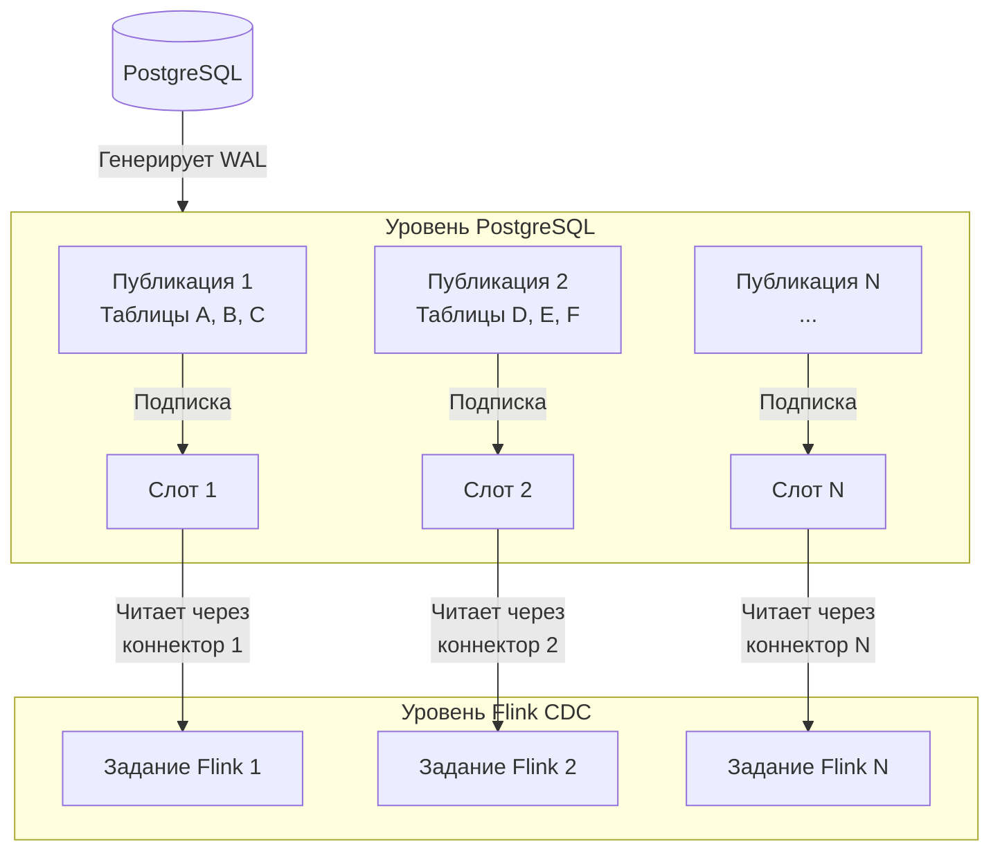

> разобрался с репликацией посгреса и выяснил что:
> - можно увидеть отставание слота, но нельзя явно и просто понять, что именно внутри слота вызвало отставание
> - на один слот можно сделать только одну подписку
> - делать подписку на публикацию в 170 таблиц это антипаттерн
> - делать много слотов (на разные подписки) это тоже антипаттерн
> - удаление подписки не всегда вызывает удаление слота
> - удаление подписки без удаления слота не прервет отставание слота
> - только удаление зависшего слота может остановить рост wal
> - нельзя сделать две и более подписок на один слот
>   вопрос в следующем
>   вот я создал публикацию в посгресе (это точно нужно делать? дебезиум или флинк точно не делают это автоматически, если не сделать самому руками?)
>   потом, допустим, сделал один слот и указал его в параметрах дебезиума
>   соотв флинк не делает своего слота, а использует указанный
>   потом я делаю задание во флинке
>   что происходит дальше?
>   флинк автоматически генерит свою подписку?
>   а когда я удаляю задание, он удаляет только подписку
>   а как он обнаруживает нужную публикацию?
>   допустим я решил сделать 5-10 публикаций
>   и сделал соотв 5-10 слотов для них (ведь по другому никак? мы же не можем сделать 5-10 подписок на один слот, так?)
>   и вот я пускаю во флинке 5-10 заданий, со своими наборами таблиц, соответственно публикациям
>   что делают флинк и дебезиум?
>   создают 5-10 автоматических подписок?
>   а как тогда они определяют, через какой слот и в какую публикацию нужно лезть?
>   или я это должен где-то указать? где и как?

Вы абсолютно правы во всех ваших выводах о работе слотов и публикаций в PostgreSQL. Вы попали в самую суть проблемы репликации. Давайте разберем это по полочкам.

### 🔍 Ответы на ваши вопросы по работе одного слота

1.  **Флинк/Дебезиум создают подписку автоматически?** — **ДА.** Когда вы в конфигурации Flink CDC указываете `'slot.name' = 'flink_slot'`, коннектор при запуске:
    *   Проверяет, существует ли слот с таким именем.
    *   Если нет — **создает слот** с указанным именем, используя логическую репликацию.
    *   Создает **подписку этого слота на публикацию** (или на всю БД, если публикация не указана).

2.  **Удаляет ли он слот при остановке?** — **ЗАВИСИТ ОТ НАСТРОЙКИ.** Ключевой параметр — `'debezium.slot.drop.on.stop'`.
    *   Если `= 'true'` (значение по умолчанию в ранних версиях) — **слот удаляется** при корректной остановке коннектора.
    *   Если `= 'false'` (рекомендуется для продакшена) — **слот НЕ удаляется**, подписка отключается, но слот и его позиция в WAL сохраняются. Это позволяет перезапустить задание без потери данных. **Именно из-за этого "зависшие" слоты накапливают WAL!**

3.  **Как он находит публикацию?** — **Через параметр `publication.name`.** Если не указать, по умолчанию используется `'dbz_publication'`. **Дебезиум также может создать ее автоматически**, если указать `'publication.autocreate.mode' = 'all_tables'`. Но это не всегда надежно. **Ручное создание публикации — это лучшая практика.**

### 🗺️ Схема: Как правильно организовать несколько публикаций и слотов

Ваша идея делать несколько публикаций и слотов — **единственно верный путь** для синхронизации сотен таблиц с разными нагрузками. Одна подписка на 170 таблиц в одном слоте действительно антипаттерн.

Вот как это должно работать:



### 🛠️ Пошаговая инструкция по настройке

1.  **В PostgreSQL: Создайте публикации логически**
    ```sql
    -- Публикация для таблиц модуля "Пользователи"
    CREATE PUBLICATION pub_users FOR TABLE users, roles, user_roles;
    -- Публикация для таблиц модуля "Заказы"
    CREATE PUBLICATION pub_orders FOR TABLE orders, order_items, payments;
    -- Публикация для справочников (редко меняются)
    CREATE PUBLICATION pub_dict FOR TABLE countries, currencies, units;
    ```

2.  **Во Flink: Создайте отдельные таблицы-источники под каждую публикацию**
    ```sql
    -- Источник для пользователей
    CREATE TABLE pg_source_users (...)
    WITH (
      'connector' = 'postgres-cdc',
      'slot.name' = 'flink_slot_users', -- УНИКАЛЬНОЕ имя слота
      'publication.name' = 'pub_users',  -- Имя вашей публикации
      'table-name' = 'users|roles|user_roles', -- Можно regex для уверенности
      'debezium.slot.drop.on.stop' = 'false' -- Важно!
    );

    -- Источник для заказов
    CREATE TABLE pg_source_orders (...)
    WITH (
      'connector' = 'postgres-cdc',
      'slot.name' = 'flink_slot_orders', -- Другой слот!
      'publication.name' = 'pub_orders',  -- Другая публикация
      'table-name' = 'orders|order_items|payments',
      'debezium.slot.drop.on.stop' = 'false'
    );
    ```

3.  **Создайте отдельные задания Flink** для каждого источника (или используйте `BEGIN STATEMENT SET` внутри одного задания для одного источника).

### ⚠️ Критически важные моменты

*   **`slot.name` должен быть уникальным для каждой публикации.** Нельзя два коннектора направить в один слот.
*   **Ручное удаление "зависших" слотов — это ваша ответственность.** Мониторьте запросом:
    ```sql
    SELECT * FROM pg_replication_slots WHERE active = 'f';
    ```
    Удаляйте неактивные: `SELECT pg_drop_replication_slot('slot_name');`
*   **При первой настройке настройте `'scan.startup.mode' = 'initial'`** для полного снимка. После можно переключить на `'latest'`.

### ✅ Итог и рекомендации

1.  **Да, создавайте публикации вручную** — это дает полный контроль.
2.  **Да, делайте отдельный слот для каждой публикации** — это правильно и не антипаттерн.
3.  **Флинк автоматически создаст подписку слота на указанную публикацию.**
4.  **Обязательно ставьте `'debezium.slot.drop.on.stop' = 'false'`** и управляйте слотами вручную.
5.  **Сгруппируйте таблицы логически** (по модулю, частоте изменений) в публикации.

Теперь у вас есть четкая схема. Пробуйте создать две тестовые публикации (например, `pub_test1` на 2 таблицы и `pub_test2` на 2 другие) и два отдельных источника во Flink, чтобы увидеть, как они работают независимо.
